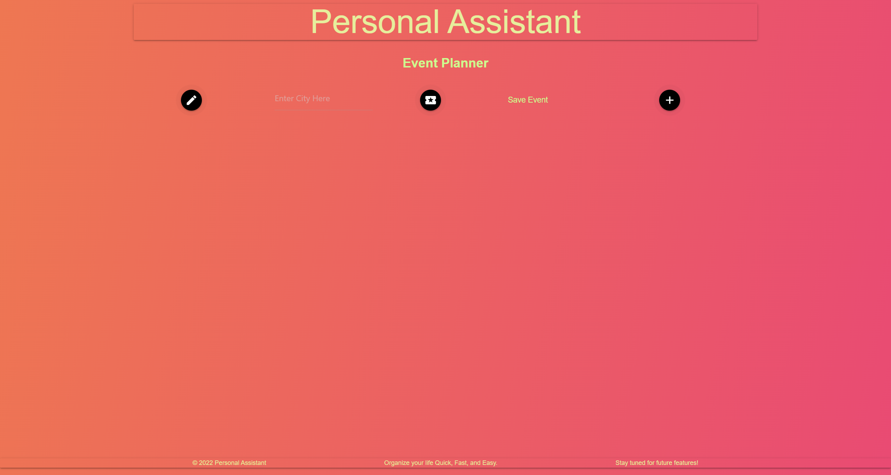
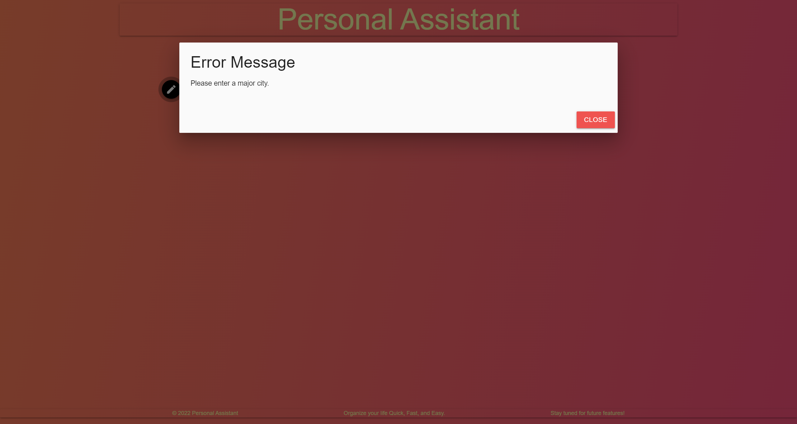
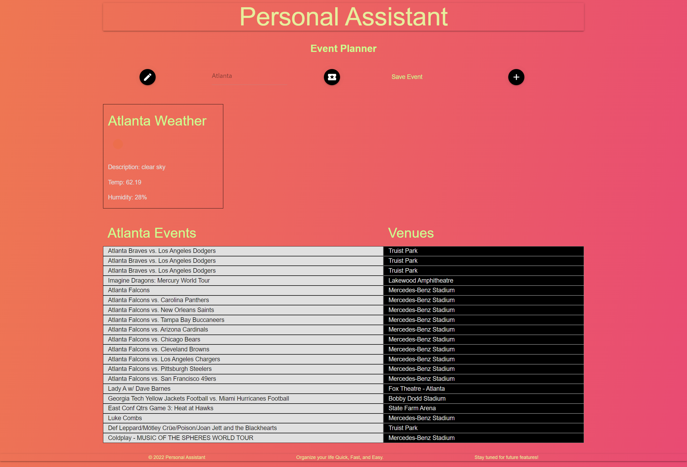

# Project 1: Interactive Front-End Application

### Personal Assistant - Event Planner

The group task for this project was to a create a simple event planner application that allows a user to search for major events happening in major cities that will provide a list of events to attend. This app will run in the browser and feature dynamically updated HTML, CSS powered by jQuery and 2 server-side APIs. 

We utilized html, css frameworks - materialize, js, 2 server-side APIs and git to build and complete this project. 

## User Story

```md
AS A user who enjoys attending events
I WANT to search for popular events in a major city
SO THAT I can select which events I’d like to attend
```

## Project Requirements

* Use a CSS framework other than Bootstrap.

* Be deployed to GitHub Pages.

* Be interactive (i.e., accept and respond to user input).

* Use at least two [server-side APIs](https://coding-boot-camp.github.io/full-stack/apis/api-resources).

* Does not use alerts, confirms, or prompts (use modals).

* Use client-side storage to store persistent data.

* Be responsive.

* Have a polished UI.

* Have a clean repository that meets quality coding standards (file structure, naming conventions, follows best practices for class/id naming conventions, indentation, quality comments, etc.).

* Have a quality README (with unique name, description, technologies used, screenshot, and link to deployed application).

## Presentation Requirements

* Elevator pitch: a one minute description of your application

* Concept: What is your user story? What was your motivation for development?

* Process: What were the technologies used? How were tasks and roles broken down and assigned? What challenges did you encounter? What were your successes?

* Demo: Show your stuff!

* Directions for Future Development

* Links to the deployed application and the GitHub repository


## Presentation Information
### [Slides Presentation](https://docs.google.com/presentation/d/1P_-2GOG0TsE_iMJzqEX5X5XKIMHlCNT_anrb6Oo8AtA/edit?usp=sharing)

You can view the GitHub Repo and Live URL below:
### [GitHub Link](https://github.com/Bungycode/Personal-Assistant) 
### [Live URL](https://bungycode.github.io/Personal-Assistant/)


##### Screenshot of the Persoanl Assistant - Event Planner:





